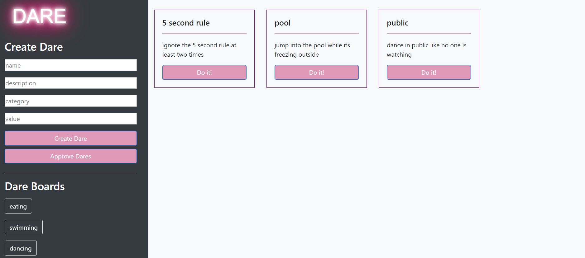

# truthOrDare
Social Media Truth or Dare App

## Full stack CRUD app that will allow to post dares and be approved or denied by your piers

## technolgoies used:
<ul>
    <li>Express</li>
    <li>Node.js</li>
    <li>MongoDB</li>
    <li>Handlebars</li>
    <li>Morgan for route logging</li>
</ul>

## what you need:
<ol>
    <li>NPM install</li>
    <li>create a .dotenv file with your own MONGODB_URI key</li>
    <li>NPM start</li>
</ol>

## home page splash screen

## dareboard main page

